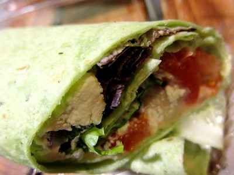
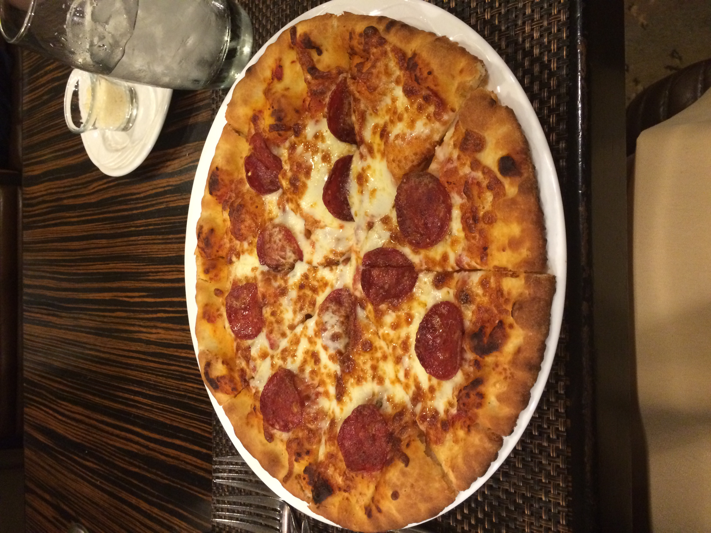

- Akademiet skolekantine
- Jeg har lagd en nettside til akademiet skolekantine med HTML, CSS og Javascript. 
- Last opp dokumentet i en valgfri søkemotor
- ChatGPT, w3schools

# 1. bilder

# 2. Tilbakemeldinger
- "Det er litt forvirrende, men man blir vant til det ganske fort"
- "Jeg vil ha en måte å se de ulike ingrediensene på"
- "Teksten kan være større og knappene kan være mer synlig og kan forskjelligjøres fra vanlig tekst"

